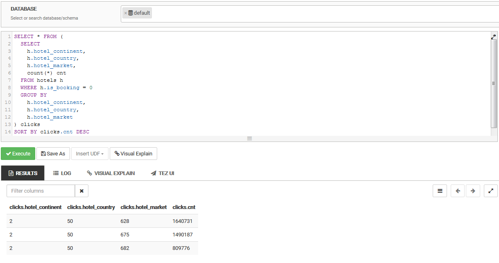

### Tables (https://www.kaggle.com/c/expedia-hotel-recommendations/data):

Load train.csv.gz into hdfs by running ```hdfs dfs -put train.csv.gz /tmp/test/hotels/train.csv.gz```

#### Fields

|Column name |	Description |	Data type |
|:-----------|:-------------|----------:|
*date_time*|Timestamp|string
*site_name*|ID of the Expedia point of sale (i.e. Expedia.com, Expedia.co.uk, Expedia.co.jp, ...)|int
*posa_continent*|ID of continent associated with site_name|int
*user_location_country*|The ID of the country the customer is located|int
*user_location_region*|The ID of the region the customer is located|int
*user_location_city*|The ID of the city the customer is located|int
*orig_destination_distance*|Physical distance between a hotel and a customer at the time of search. A null means the distance could not be calculated|double
*user_id*|ID of user|int
*is_mobile*|1 when a user connected from a mobile device, 0 otherwise|tinyint
*is_package*|1 if the click/booking was generated as a part of a package (i.e. combined with a flight), 0 otherwise|int
*channel*|ID of a marketing channel|int
*srch_ci*|Checkin date|string
*srch_co*|Checkout date|string
*srch_adults_cnt*|The number of adults specified in the hotel room|int
*srch_children_cnt*|The number of (extra occupancy) children specified in the hotel room|int
*srch_rm_cnt*|The number of hotel rooms specified in the search|int
*srch_destination_id*|ID of the destination where the hotel search was performed|int
*srch_destination_type_id*|Type of destination|int
*hotel_continent*|Hotel continent|int
*hotel_country*|Hotel country|int
*hotel_market*|Hotel market|int
*is_booking*|1 if a booking, 0 if a click|tinyint
*cnt*|Numer of similar events in the context of the same user session|bigint
*hotel_cluster*|ID of a hotel cluster|int

### To create the tables above run:

```shell
hive -d HOTELS_TABLE_NAME=hotels \
-d HOTELS_FILE_LOCATION=/tmp/test/hotels \
-f create_hotels_table.hql
```

Console output:

```shell
[root@sandbox-hdp ~]# hive -d HOTELS_TABLE_NAME=hotels \
-d HOTELS_FILE_LOCATION=/tmp/test/hotels \
-f create_hotels_table.hql                                                                                                                                                         
log4j:WARN No such property [maxFileSize] in org.apache.log4j.DailyRollingFileAppender.                                                                                                                       
                                                                                                                                                                                                              
Logging initialized using configuration in file:/etc/hive/2.6.5.0-292/0/hive-log4j.properties                                                                                                                 
OK                                                                                                                                                                                                            
Time taken: 4.625 seconds                                                                                                                                                                                     
```


### To calculate Top 3 most popular countries where booking is successful (booking = 1):

```hive -d HOTELS_TABLE_NAME=hotels -f select_top3_countries_with_succ_booking.hql```

Console output:

```shell                                                                                                                                                                                  
[root@sandbox-hdp ~]# hive -d HOTELS_TABLE_NAME=hotels -f select_top3_countries_with_succ_booking.hql                                                                                                                                                                        
                                                                                                               
Query ID = root_20181108145545_f1594bb5-c096-4898-8328-96b9af872600                                                                                                                                           
Total jobs = 1                                                                                                                                                                                                
Launching Job 1 out of 1                                                                                                                                                                                      
Status: Running (Executing on YARN cluster with App id application_1541682191139_0007)                                                                                                                        
                                                                                                                                                                                                              
--------------------------------------------------------------------------------
        VERTICES      STATUS  TOTAL  COMPLETED  RUNNING  PENDING  FAILED  KILLED
--------------------------------------------------------------------------------
Map 1 ..........   SUCCEEDED      1          1        0        0       0       0
Reducer 2 ......   SUCCEEDED      1          1        0        0       0       0                                                                                                                              
Reducer 3 ......   SUCCEEDED      1          1        0        0       0       0                                                                                                                              
--------------------------------------------------------------------------------
VERTICES: 03/03  [==========================>>] 100%  ELAPSED TIME: 53.31 s    
--------------------------------------------------------------------------------
OK                                                                                                                                                                                                            
50      1616055                                                                                                                                                                                               
198     197228                                                                                                                                                                                                
70      102651                                                                                                                                                                                                
Time taken: 60.347 seconds, Fetched: 3 row(s)                                                                                                                                                                 
```


### To calculate the longest period of stay of couples with children:

```hive -d HOTELS_TABLE_NAME=hotels -f select_longest_period_of_stay.hql```

Console output:

```shell
[root@sandbox-hdp ~]# hive -d HOTELS_TABLE_NAME=hotels -f select_longest_period_of_stay.hql                                                                                                                                                                                                                                                                                            
                                                                                                                                 
Query ID = root_20181108154557_c07f3c69-eb94-40d0-b41b-43453646afdf                                                                                                                                           
Total jobs = 1                                                                                                                                                                                                
Launching Job 1 out of 1                                                                                                                                                                                      
Status: Running (Executing on YARN cluster with App id application_1541682191139_0013)                                                                                                                        
                                                                                                                                                                                                              
--------------------------------------------------------------------------------
        VERTICES      STATUS  TOTAL  COMPLETED  RUNNING  PENDING  FAILED  KILLED
--------------------------------------------------------------------------------
Map 1 ..........   SUCCEEDED      1          1        0        0       0       0
Reducer 2 ......   SUCCEEDED      1          1        0        0       0       0                                                                                                                              
--------------------------------------------------------------------------------
VERTICES: 02/02  [==========================>>] 100%  ELAPSED TIME: 55.14 s    
--------------------------------------------------------------------------------
OK                                                                                                                                                                                                            
390                                                                                                                                                                                                           
Time taken: 80.179 seconds, Fetched: 1 row(s)                                                                                                                                                                                                                                                                                                                                
```


### To calculate top 3 most popular hotels (treat hotel as composite key of continent, country and market) which were not booked:

> Most popular means most searches in dataset

> Not booked means column booked = 0

```hive -d HOTELS_TABLE_NAME=hotels -f select_top3_hotels_from_clicks.hql```

Console output:

```shell
[root@sandbox-hdp ~]# hive -d HOTELS_TABLE_NAME=hotels -f select_top3_hotels_from_clicks.hql                                                                                                                                                                       
                                                                                                               
Query ID = root_20181109120929_ad7ac3ec-9fe3-424b-90fe-fbb4dd99c47b                                                                                                                                           
Total jobs = 1                                                                                                                                                                                                
Launching Job 1 out of 1                                                                                                                                                                                      
Status: Running (Executing on YARN cluster with App id application_1541682191139_0017)                                                                                                                        
                                                                                                                                                                                                              
--------------------------------------------------------------------------------
        VERTICES      STATUS  TOTAL  COMPLETED  RUNNING  PENDING  FAILED  KILLED
--------------------------------------------------------------------------------
Map 1 ..........   SUCCEEDED      1          1        0        0       0       0
Reducer 2 ......   SUCCEEDED      1          1        0        0       0       0                                                                                                                              
Reducer 3 ......   SUCCEEDED      1          1        0        0       0       0                                                                                                                              
Reducer 4 ......   SUCCEEDED      1          1        0        0       0       0                                                                                                                              
--------------------------------------------------------------------------------
VERTICES: 04/04  [==========================>>] 100%  ELAPSED TIME: 45.55 s   
--------------------------------------------------------------------------------
OK                                                                                                                                                                                                            
2       50      628     1640731                                                                                                                                                                               
2       50      675     1490187                                                                                                                                                                               
2       50      682     809776                                                                                                                                                                                
Time taken: 53.434 seconds, Fetched: 3 row(s)                                                                                                                                                                
```


